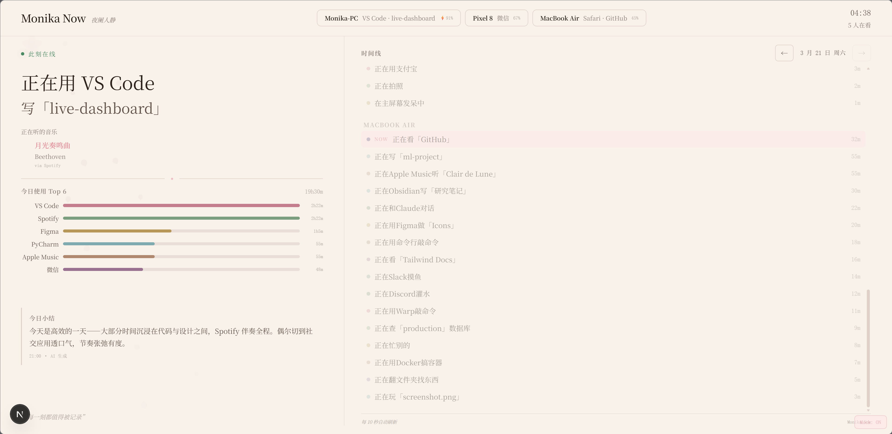
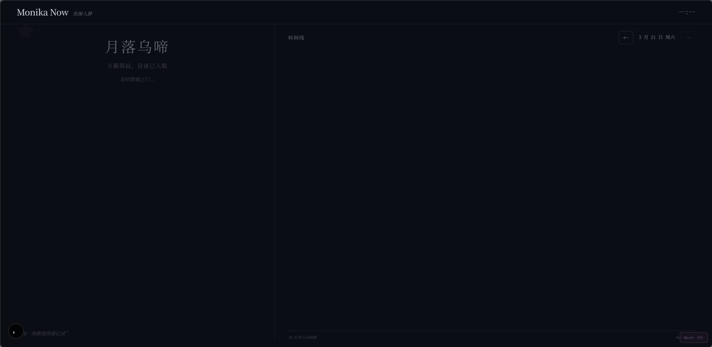

# Live Dashboard — 花信 · Blossom Letter

> `redesign/blossom-letter` 分支 — 文艺书卷风前端重设计
>
> 基础功能、Agent 配置、后端部署等通用文档请参阅 [`main` 分支 README](https://github.com/Monika-Dream/live-dashboard/tree/main#readme)。

## 预览

**亮色模式（设备在线）**



**暗色模式（设备离线）**



## 这个分支做了什么

完整重写了前端 UI，从经典和风（猫耳气泡框 + 粉色系）切换为文艺书卷风格。后端新增 AI 每日总结功能。

### 前端变化

| 项目 | main 分支 | 本分支 |
|------|-----------|--------|
| **色系** | HEX 暖粉色 | OKLCH 暖纸色系（感知均匀） |
| **字体** | Quicksand / Zen Maru Gothic | Fraunces（display）+ Noto Serif SC + Source Sans 3 |
| **布局** | 单栏居中 | 38% / 62% 双栏（左：状态 / 右：时间线） |
| **活动展示** | 猫耳 VN 对话气泡框 | 诗意大字排版 + 分行（应用名 / 正在做什么） |
| **设备** | 卡片列表 | 顶栏按钮（可点击筛选时间线） |
| **音乐** | 描述末尾附带 | 独立音乐区块（标题 / 歌手 / 来源 + 动态音频条） |
| **时间线** | 简单列表 | 按设备分组 + "此刻"实时汇总置顶 + 聚合用量 |
| **统计** | 无 | Top 6 应用用量横向图表 |
| **离线状态** | 暗色背景 + 萤火虫 | "月落乌啼 / 万籁俱寂" 诗意文字 |
| **夜间模式** | 深紫色 | OKLCH 深蓝墨色（设备全离线时自动切换） |
| **花瓣动画** | 20 片粉色花瓣 | 12 片暖灰花瓣，三种摇摆路径斜向飘落，mask 渐隐不越过右栏 |
| **AI 总结** | 无 | 左下角"今日小结"，每晚 21:00 AI 生成 |

### 后端变化

| 新增 | 说明 |
|------|------|
| `daily_summaries` 表 | SQLite 存储每日总结（`date` 主键 + `summary` + `generated_at`） |
| `GET /api/daily-summary` | 查询参数 `?date=YYYY-MM-DD`，返回对应日期的总结 |
| `daily-summary-gen.ts` | 每晚 21:00 汇总当日活动数据，调用 AI API 生成 50-80 字中文总结 |
| 7 天自动清理 | `cleanupOldSummaries` 随每小时清理任务一起执行 |

### 变更文件

```
packages/frontend/
├── app/globals.css        # 完整重写 — 花信设计系统（OKLCH 变量、双栏、花瓣动画、夜间模式）
├── app/layout.tsx         # 简化为 app-shell grid
├── app/page.tsx           # 完整重写 — 所有 UI 内联（~560 行，含 50+ 条 mock 时间线数据）
└── src/components/        # 原组件保留但未使用（所有 UI 已内联到 page.tsx）

packages/backend/
├── src/db.ts                          # 新增 daily_summaries 表 + prepared statements
├── src/index.ts                       # 新增 /api/daily-summary 路由
├── src/routes/daily-summary.ts        # 新增 — GET handler
├── src/services/daily-summary-gen.ts  # 新增 — AI 生成逻辑
└── src/services/cleanup.ts            # 新增 summaries 清理 + 21:00 定时触发
```

## 本分支独有配置

除了 `main` 分支已有的环境变量（`DEVICE_TOKEN_N`、`HASH_SECRET`、`PORT` 等），本分支额外支持：

| 变量 | 必填 | 说明 | 示例 |
|------|------|------|------|
| `AI_API_URL` | 否 | OpenAI 兼容的 Chat Completions 端点 | `https://api.openai.com/v1/chat/completions` |
| `AI_API_KEY` | 否 | API 密钥（Bearer token） | `sk-...` |
| `AI_MODEL` | 否 | 模型名称（默认 `gpt-4o-mini`） | `gpt-4o-mini` |

### 支持的 AI 提供商

任何兼容 OpenAI Chat Completions 格式的服务均可：

| 提供商 | `AI_API_URL` | 推荐 `AI_MODEL` |
|--------|-------------|-----------------|
| OpenAI | `https://api.openai.com/v1/chat/completions` | `gpt-4o-mini` |
| Claude (via proxy) | 你的代理地址 | `claude-3-haiku-20240307` |
| DeepSeek | `https://api.deepseek.com/chat/completions` | `deepseek-chat` |
| 本地 Ollama | `http://localhost:11434/v1/chat/completions` | `qwen2.5:7b` |

### 不配置 AI 会怎样？

不设置 `AI_API_URL` 和 `AI_API_KEY` 时，AI 总结功能静默跳过，不影响其他一切功能。前端显示"每晚 21:00 自动生成"占位文本。

## 自定义色板

编辑 `packages/frontend/app/globals.css` 中的 CSS 变量。本分支使用 OKLCH 色彩空间：

```css
:root {
  --bg:          oklch(96.5% 0.012 65);   /* 页面背景（暖纸色） */
  --bg-surface:  oklch(94% 0.015 58);     /* 卡片 / 表面 */
  --ink:         oklch(22% 0.02 50);      /* 主文字 */
  --sakura:      oklch(68% 0.13 12);      /* 强调色（花瓣、链接） */
  --sage:        oklch(58% 0.09 155);     /* 在线状态 */
  --gold:        oklch(62% 0.11 70);      /* 点缀色 */
}
```

夜间模式在 `body.night-mode` 中覆盖全部变量，设备全离线时自动启用。

## 使用方式

```bash
# 克隆此分支
git clone -b redesign/blossom-letter https://github.com/Monika-Dream/live-dashboard.git

# 后续的 .env 配置、后端启动、前端构建等步骤与 main 分支完全一致
# 参阅 main 分支 README：https://github.com/Monika-Dream/live-dashboard#readme
```

如需启用 AI 每日总结，额外在 `.env` 中添加 `AI_API_URL`、`AI_API_KEY`（和可选的 `AI_MODEL`）即可。

## 许可证

MIT
